### 第一题，countOfAirplanes
LintCode第391题：https://www.lintcode.com/problem/391/

**下面是给出的java代码模板，在此基础上完成题目**
```Java
/**
 * Definition of Interval:
 * public class Interval {
 *     int start, end;
 *     Interval(int start, int end) {
 *         this.start = start;
 *         this.end = end;
 *     }
 * }
 */

public class Solution {
  /**
   * @param airplanes: An interval array
   * @return: Count of airplanes are in the sky.
   */
  public int countOfAirplanes(List<Interval> airplanes) {
    // write your code here
  }
}
```
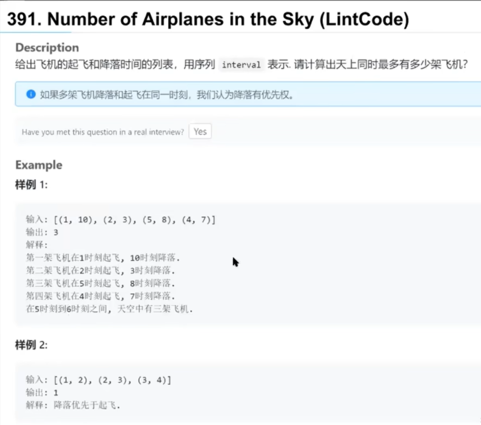
**解题思路:**
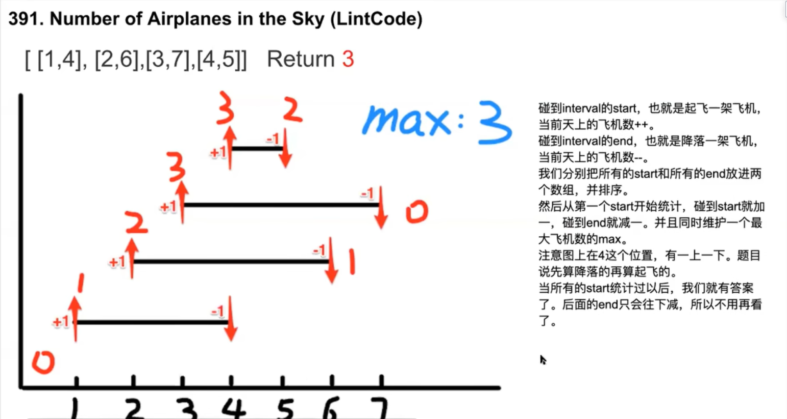

### 第二题，Meeting Rooms
给定一个会议时间间隔数组，确定一个人是否可以参加所有会议。
Interval类在第一题代码模板里

**解题思路:**


### 第三题，Meeting Rooms Ⅱ
求所需最少的会议室数量，来保证会议时间间隔数组的所有会议可以正常进行
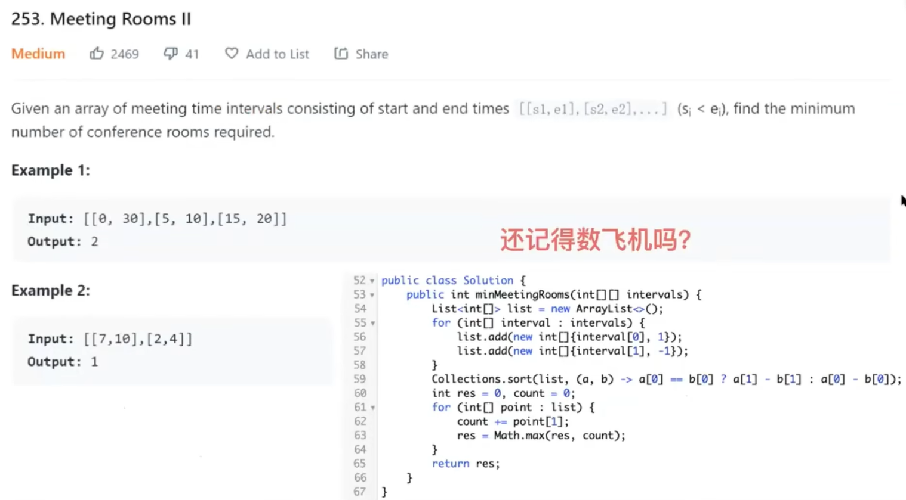
上图的解法是较好的解法，下面是一般的PQ解法（PriorityQueue）
每次都拿结束时间最小的和新会议比，不冲突就沿用改会议室，冲突就再开一个新会议室
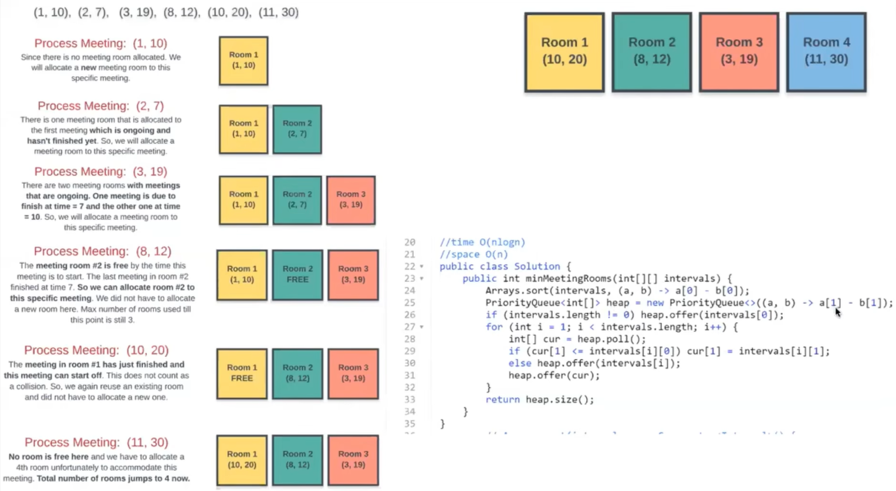
下面是第三种解法的思路，与解法一类似
分别维护了一个会议房间数和一个已结束的会议数
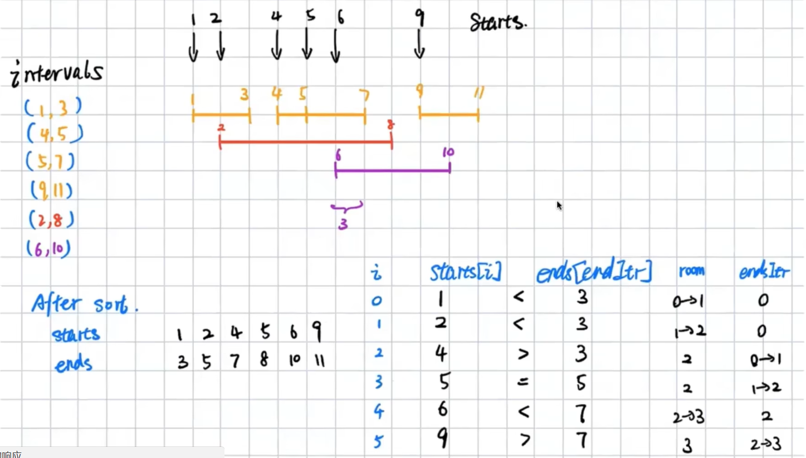
解法三的代码如下
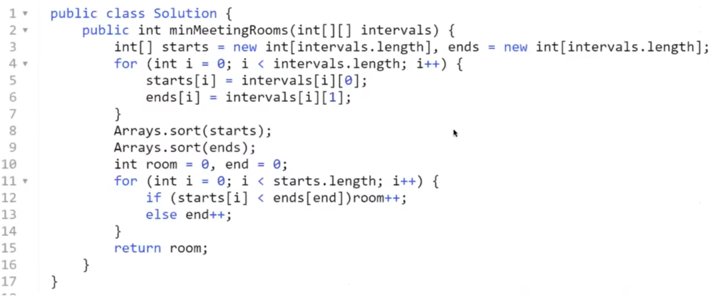

### 第四题，Merge Intervals
给定一个区间集合，合并所有重叠的区间。

**解题思路**


### 第五题，Insert Interval
给定一组不重叠的区间，在区间中插入一个新的区间(必要时合并)。  
您可以认为间隔最初是根据它们的开始时间排序的。


### 第六题，Remove Interval
给定一个不相交区间的排序列表，每个区间interval [i] = [a, b],表示满足a <= x <b的实数x的集合。  
我们删除间隔中任何间隔与要移动的间隔之间的交点。   
在所有这些删除之后返回一个排序的间隔列表。

**解题思路**


### 第七题，Non-overlapping Intervals
给定一个区间集合，找出需要删除的最小区间数，以使其余的区间不重叠。

**解题思路**   
如果冲突总是删除end靠后的，给下一个比较的interval留下更多的空间。


### 第八题，Remove Covered Intervals
给定一个区间列表，删除列表中其他区间覆盖的所有区间。区间[a,b)由区间[c,d)覆盖当且仅当c <= a且b <= d。
只有两头完全覆盖才remove  
这样做之后，返回剩余的间隔数。

**解题思路**

---


### 第九题，Data Stream as Disjoint Intervals
给定非负整数a1, a2，…的数据流输入，输入一次更新一次结果，将到目前为止看到的数字总结为一个不相交的区间列表。  
例如，假设数据流中的整数是1,3,7,2,6，..，则总结为:  
(2出现时，同时在1、3旁边，合并1、2、3；6出现时只在7旁边，合并6、7)

**解题思路**


### 第十题，Meeting Scheduler
已知两个人的可用时隙数组slots1和slots2，以及会议持续时间duration，则返回两人都可以使用的最早的时间段。  
如果没有满足要求的公共时隙，则返回空数组。  
时间段的格式是由两个元素[start, end]组成的数组，表示从开始到结束的包含时间范围。  
保证同一个人的两个可用位不会相互交叉。即对于同一个人的任意两个时间槽[start1, end1]和[start2, end2]，要么是start1 > end2，要么是start2 > end1。
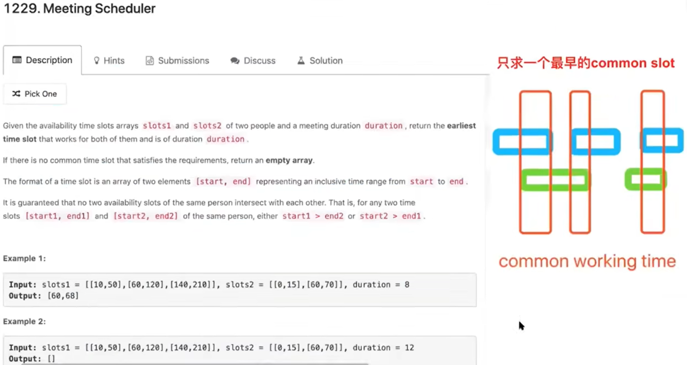
**解题思路**
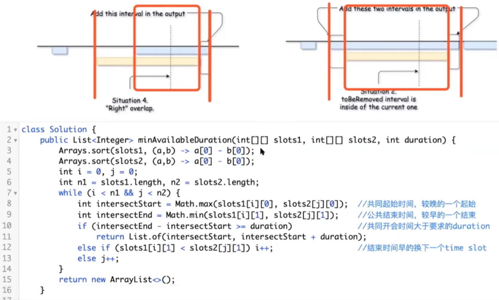

### 第十一题，Interval List Intersections
给定两个闭区间列表，每个区间列表是成对不相交的，并且是有序的。  
返回这两个区间列表的交集。   
(形式上，闭合区间[a, b](带a <= b)表示a <= x <= b的实数集合x。两个闭合区间的交点是一个实数集合，该实数集合要么为空，要么可以表示为闭合区间。例如，[1,3]和[2,4]的交点是[2,3]。)
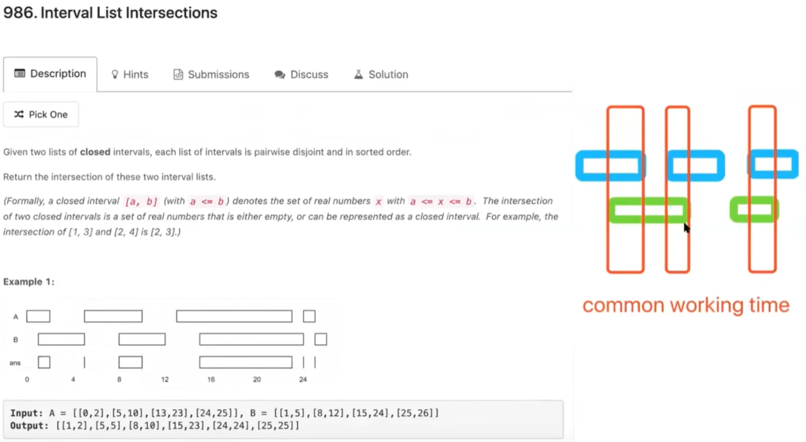
**解题思路**
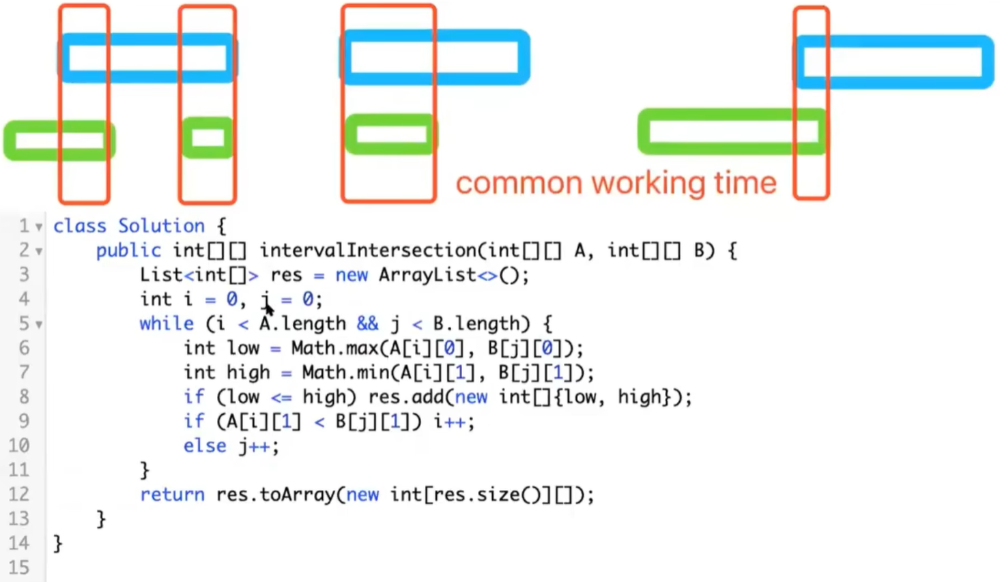

### 第十二题，Employee Free Time
我们有一个员工的时间表列表，它表示每个员工的工作时间。  
每个员工都有一个不重叠的间隔列表，这些间隔是按顺序排列的。  
返回有限间隔的列表，表示所有员工的公共正长度空闲时间，也是按顺序排列的。  
(尽管我们用[x, y]的形式表示interval，但其中的对象是intervals，而不是列表或数组。例如:schedule[0][0].Start = 1, schedule[0][0].End = 2,且schedule[0][0][0]未定义)。  
此外，我们不会在答案中包括[5,5]这样的间隔，因为它们的长度为零。
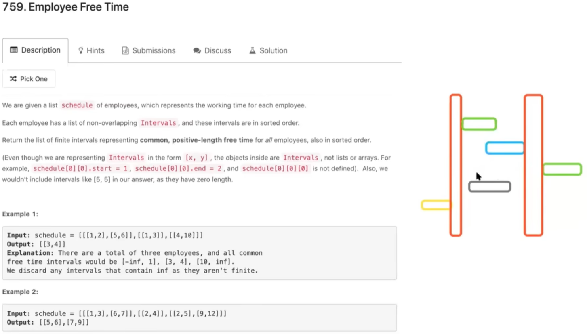
**解题思路**
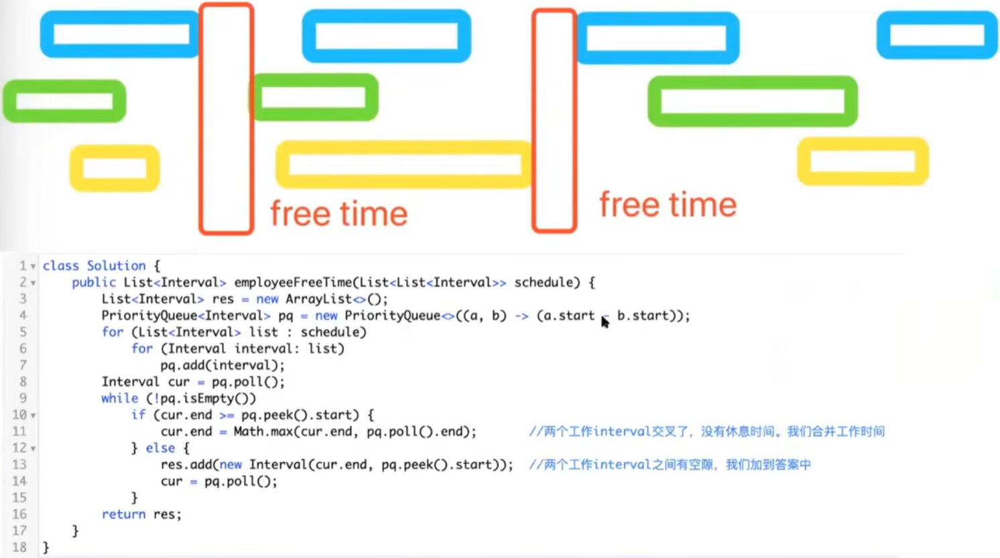


