### 第一题，LintCode第391题
https://www.lintcode.com/problem/391/

**下面是给出的java代码模板，在此基础上完成题目**
```Java
/**
 * Definition of Interval:
 * public class Interval {
 *     int start, end;
 *     Interval(int start, int end) {
 *         this.start = start;
 *         this.end = end;
 *     }
 * }
 */

public class Solution {
  /**
   * @param airplanes: An interval array
   * @return: Count of airplanes are in the sky.
   */
  public int countOfAirplanes(List<Interval> airplanes) {
    // write your code here
  }
}
```
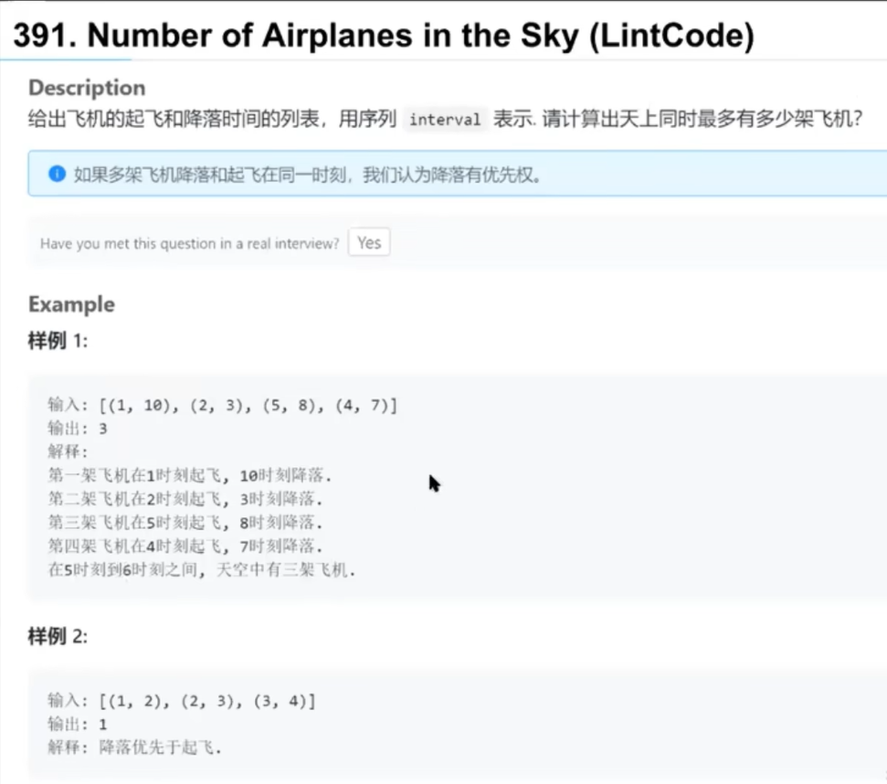
**解题思路:**
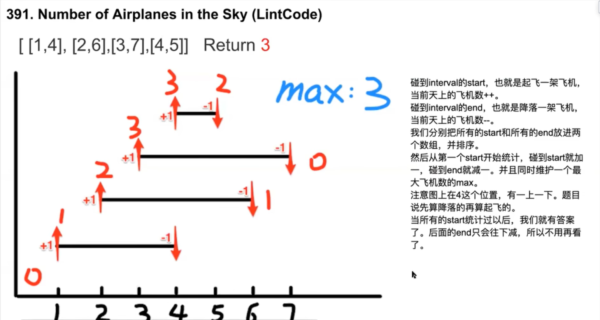

### 第二题，Meeting Rooms
给定一个会议时间间隔数组，确定一个人是否可以参加所有会议。
Interval类在第一题代码模板里
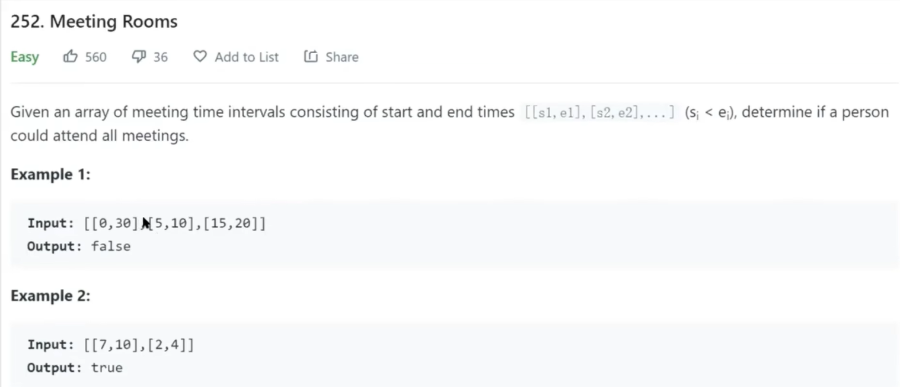
**解题思路:**
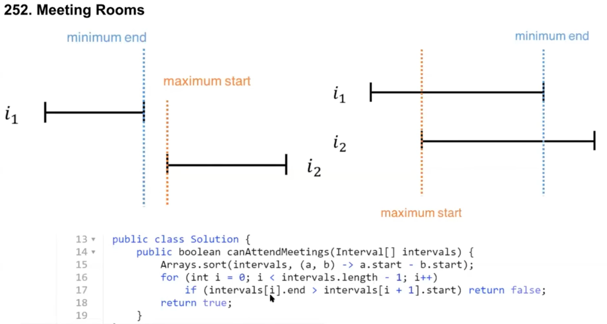

### 第三题，Meeting Rooms Ⅱ
求所需最少的会议室数量，来保证会议时间间隔数组的所有会议可以正常进行
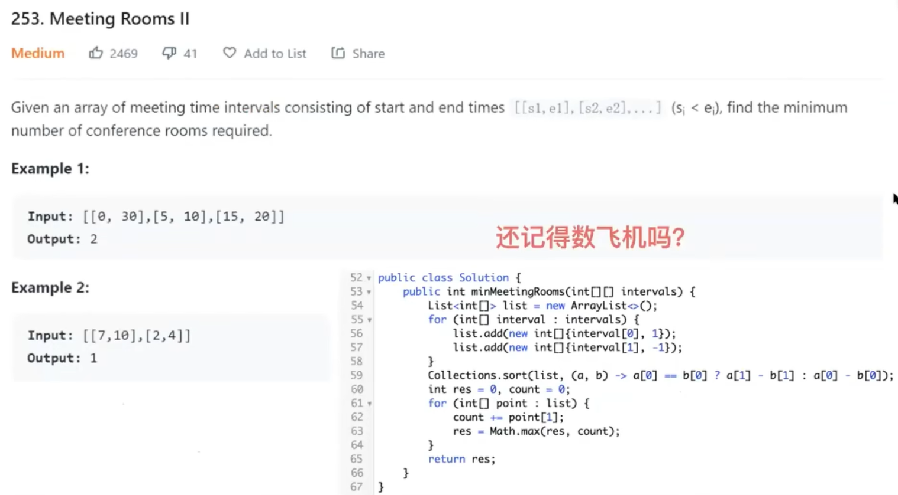
上图的解法是较好的解法，下面是一般的PQ解法（PriorityQueue）
每次都拿结束时间最小的和新会议比，不冲突就沿用改会议室，冲突就再开一个新会议室

下面是第三种解法的思路，与解法一类似
分别维护了一个会议房间数和一个已结束的会议数
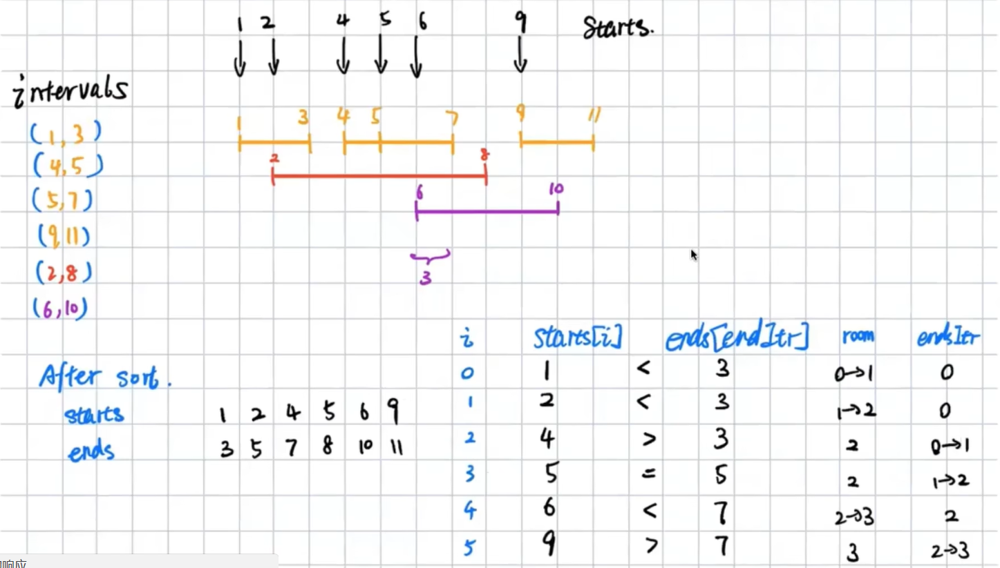
解法三的代码如下
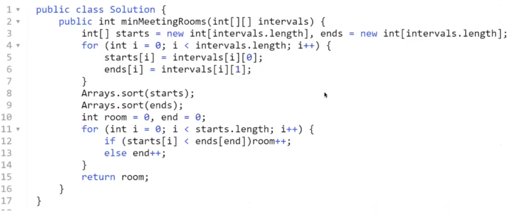

### 第四题，Merge Intervals
给定一个区间集合，合并所有重叠的区间。
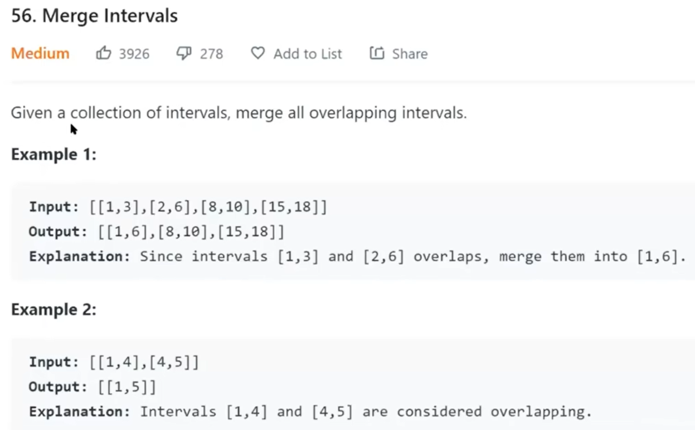
**解题思路**
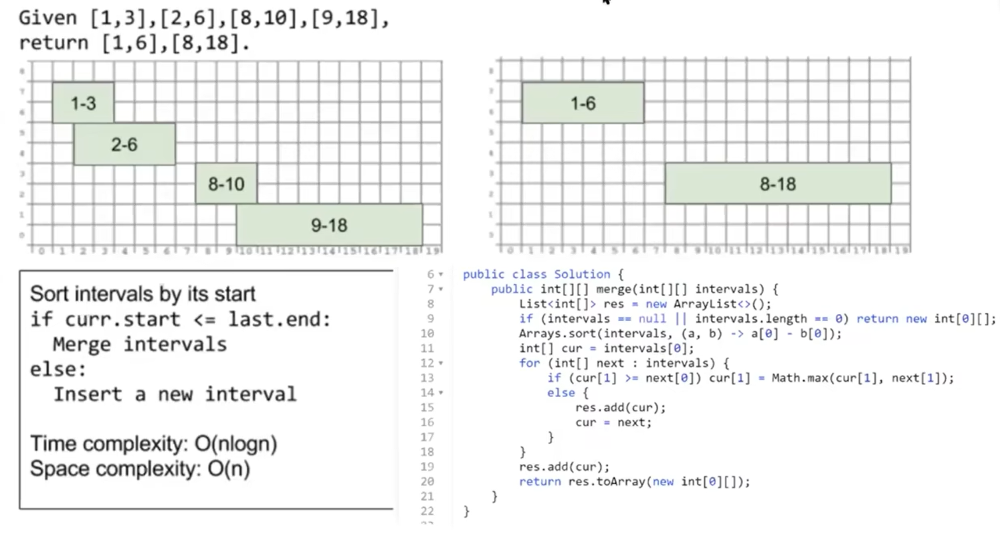

### 第五题，Insert Interval
给定一组不重叠的区间，在区间中插入一个新的区间(必要时合并)。  
您可以认为间隔最初是根据它们的开始时间排序的。
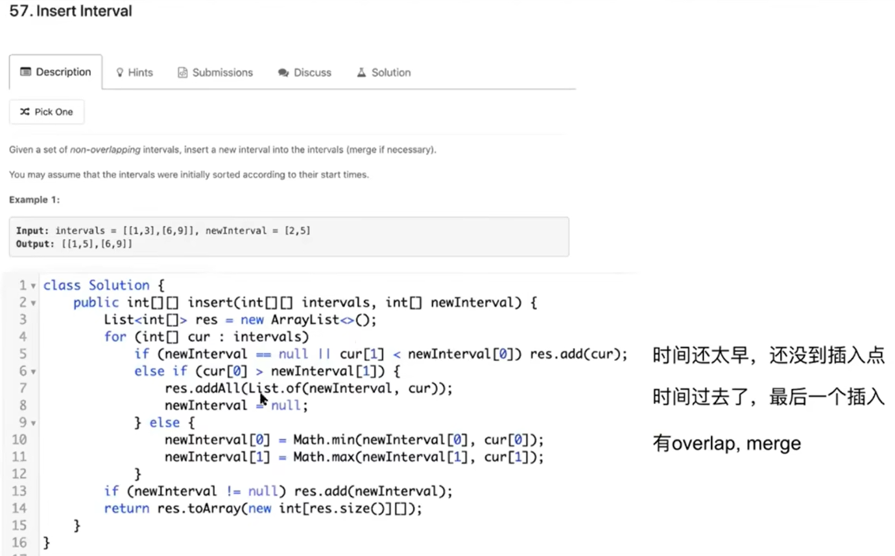

### 第六题，Remove Interval
给定一个不相交区间的排序列表，每个区间interval [i] = [a, b],表示满足a <= x <b的实数x的集合。  
我们删除间隔中任何间隔与要移动的间隔之间的交点。   
在所有这些删除之后返回一个排序的间隔列表。
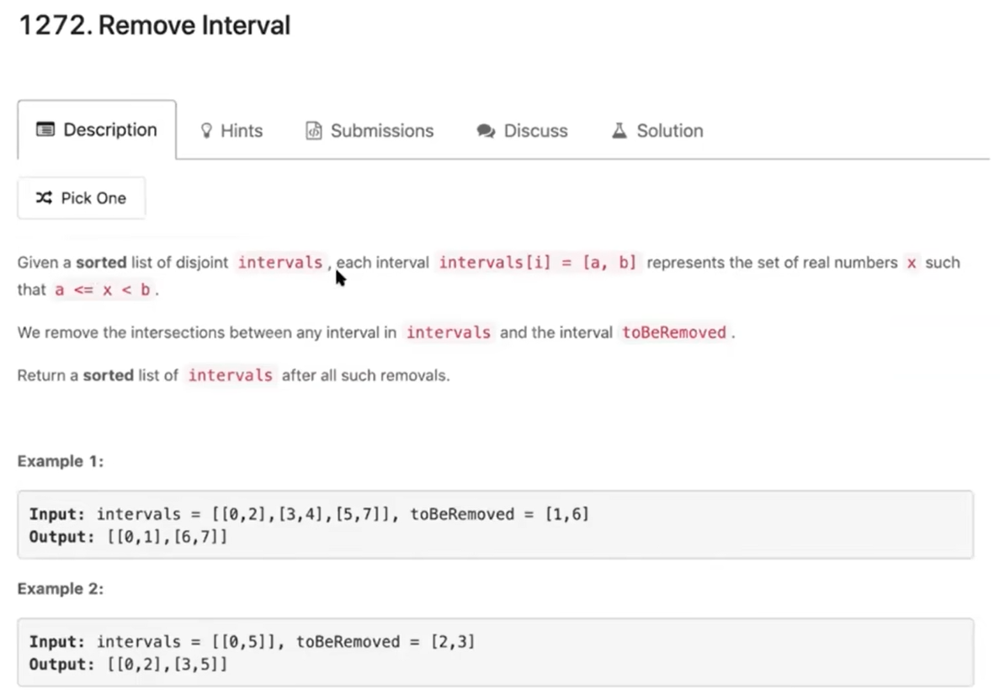
**解题思路**
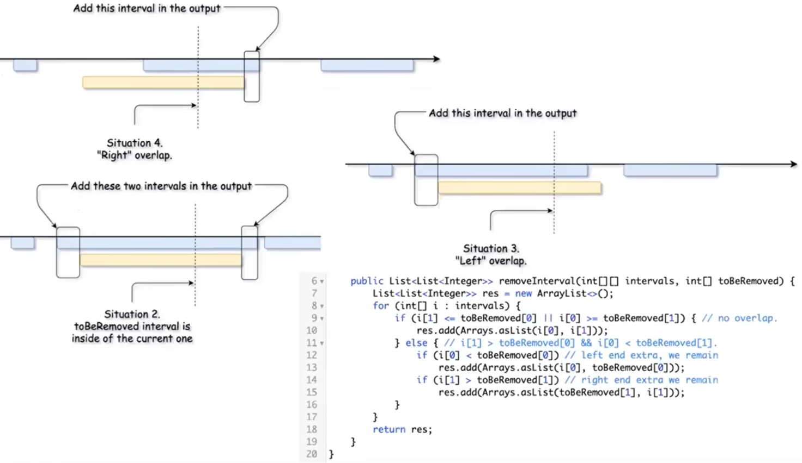

### 第七题，Non-overlapping Intervals
给定一个区间集合，找出需要删除的最小区间数，以使其余的区间不重叠。
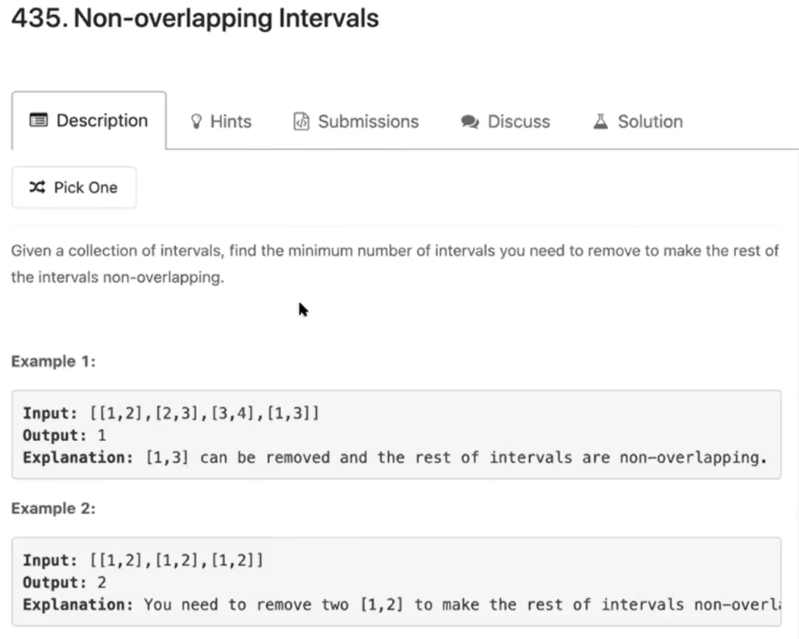
**解题思路**   
如果冲突总是删除前一个，给后一个留下更多的空间。
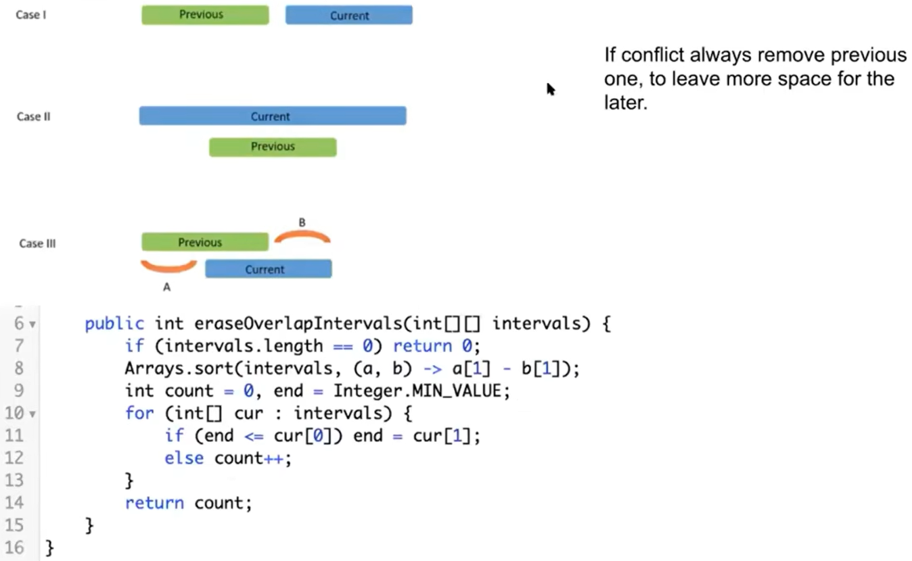

